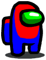

# Imagining 'Among Us' in OpenGL
#### - By Anmol Agarwals

### Gameplay
The game is a reimagination of the popular game [AMONG US](https://youtu.be/p0aHDT8wwrw) (developed by InnerSloth), in OpenGL.
It was built by me as a part of the Computer Graphics Spring 2021 course.
The player starts at the bottom left corner of the maze and the aim is to reach the top-right of the maze. Throughout the game, the player is chased by the impostor, coming in contact with whom the player gets killed. The player cannot exit the maze without killing the impostor and releasing the obstacles/bonus collectibles.

<hr/>

### Maze Generation and Path Finding Algorithm

* The maze is generated using **Depth First Search with a backtracking approach** (this generates a random maze at every run).
* Also, I am using **BFS to precompute which direction will be the best** for the impostor to move (pre-computations is characterized by a 4 tuple of src_x, src_y, dest_x, dest_y). If the impostor is in cell (x1, y1) and player is in cell (x2, y2), then the direction in which the impostor should move to have the shortest path to the player is precomputed. The precomputation prevents the need for repetitive computation at every frame while the game is being played and enhances the experience.
<hr/>

### Tasks for the crewmate
<p align="center">
  
</p>

Although the tasks can be completed in any order, both of them must be completed in order for the EXIT to become visible.
* Find and press the VAPORIZE button to kill the impostor before it kills the player.
* Find and press the SURPRISE button to release CROWN collectibles and harmful obstacles throughout the maze.
<hr/>

 <p>This is a bonus collectible which can be collected by the player to increase his score.</p>


<p>This is the VAPORIZE button which be pressed by the player to vaporize the impostor.</p>


<p>This is the SURPRISE button on pressing which all the bonus crowns and the obstacles become visible.</p>


<p>This is the obstacle coming on contact with which the player loses score.</p>

<hr/>

### Controls
- <kbd>W</kbd>: TOP
- <kbd>S</kbd>: BOTTOM
- <kbd>A</kbd>: LEFT
- <kbd>D</kbd>: RIGHT
- <kbd>Z</kbd>: Toggle the light switch ON or OFF

### Ways to Die
* The time runs out
* The player gets caught by the Imposter.

### Scoring
* To keep up with the spirit of the original game, the player **can turn the lights ON or OFF** (although this does not make much of a difference in the current version) except than leading to higher scores.
* For every instant spent inside the maze, the score gets increased. The magnitude of increase in score is higher in case the lights are switched off.
* Vaporizing the impostor and collecting CROWN collectibles also increase the score whereas coming in contact with obstacles decreases the score.

### Some details
* For text rendering, I have used `<ft2build.h>` which must be present in /usr folder of the machine (resource used to learn: excellent tutorials on learnOpenGL) .
* For loading textures, I have used `stb_image.cpp` which is available for open source use.
* I have used sprites for characters and textures for buttons, obstacles, rewards.

### To build and run
```bash
$ ./run.sh
```

##### Build Requirements
* `OpenGL`
* `GLAD`
* `GLFW`

<hr/>


